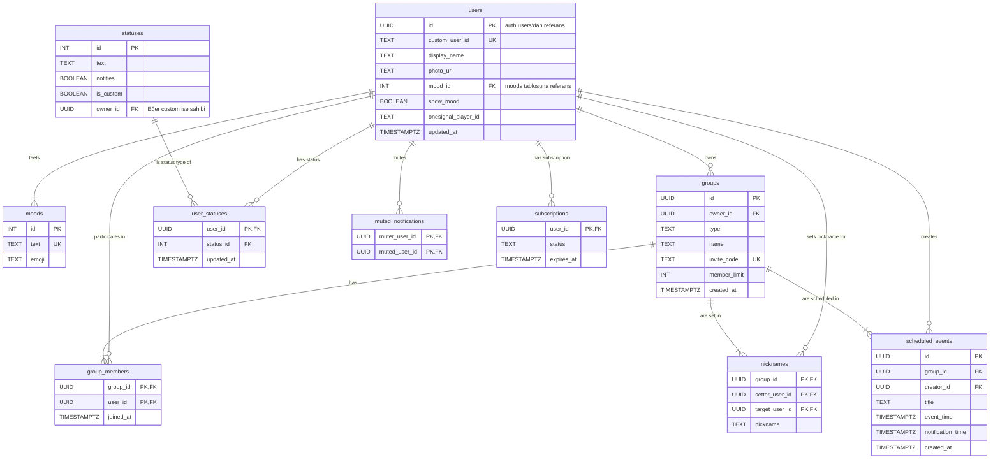

```mermaid
erDiagram
    users {
        UUID id PK "auth.users'dan referans"
        TEXT custom_user_id UK
        TEXT display_name
        TEXT photo_url
        INT mood_id FK "moods tablosuna referans"
        BOOLEAN show_mood
        TEXT onesignal_player_id
        TIMESTAMPTZ updated_at
    }

    moods {
        INT id PK
        TEXT text UK
        TEXT emoji
    }

    groups {
        UUID id PK
        UUID owner_id FK
        TEXT type
        TEXT name
        TEXT invite_code UK
        INT member_limit
        TIMESTAMPTZ created_at
    }

    group_members {
        UUID group_id PK, FK
        UUID user_id PK, FK
        TIMESTAMPTZ joined_at
    }

    nicknames {
        UUID group_id PK, FK
        UUID setter_user_id PK, FK
        UUID target_user_id PK, FK
        TEXT nickname
    }

    statuses {
        INT id PK
        TEXT text
        BOOLEAN notifies
        BOOLEAN is_custom
        UUID owner_id FK "Eğer custom ise sahibi"
    }

    user_statuses {
        UUID user_id PK, FK
        INT status_id FK
        TIMESTAMPTZ updated_at
    }

    muted_notifications {
        UUID muter_user_id PK, FK
        UUID muted_user_id PK, FK
    }

    subscriptions {
        UUID user_id PK, FK
        TEXT status
        TIMESTAMPTZ expires_at
    }

    scheduled_events {
        UUID id PK
        UUID group_id FK
        UUID creator_id FK
        TEXT title
        TIMESTAMPTZ event_time
        TIMESTAMPTZ notification_time
        TIMESTAMPTZ created_at
    }

    users ||--|{ moods : "feels"
    users ||--o{ groups : "owns"
    users ||--o{ group_members : "participates in"
    groups ||--|{ group_members : "has"
    users ||--o{ nicknames : "sets nickname for"
    groups ||--|{ nicknames : "are set in"
    users ||--o{ user_statuses : "has status"
    statuses ||--o{ user_statuses : "is status type of"
    users ||--o{ muted_notifications : "mutes"
    users ||--o{ subscriptions : "has subscription"
    users ||--o{ scheduled_events : "creates"
    groups ||--|{ scheduled_events : "are scheduled in"


```